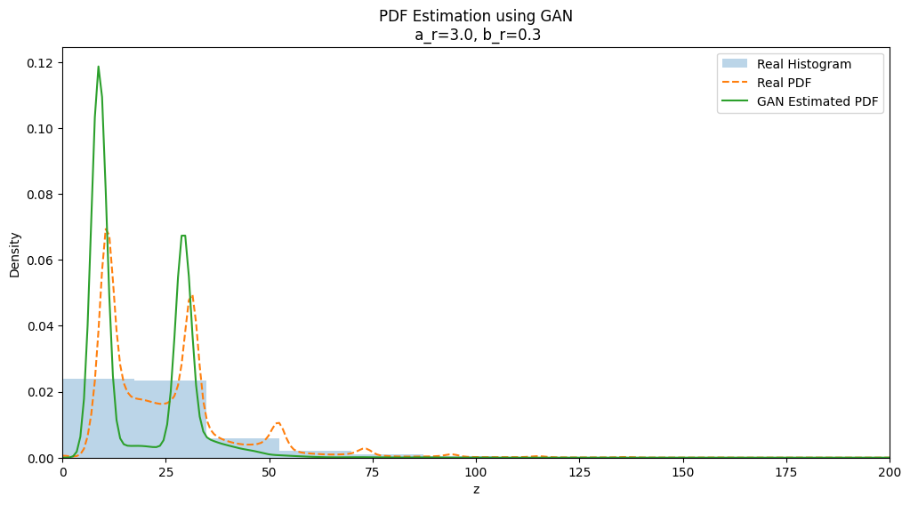

# Learning Probability Density Functions using GAN  
### _{NO₂ Concentration – India Air Quality Dataset}_

## Objective

To learn the **unknown probability density function (PDF)** of a transformed random variable using a **Generative Adversarial Network (GAN)** without assuming any parametric distribution.

The model must:

- Learn the distribution **only from samples**
- Not assume Gaussian, Exponential, or any known PDF
- Estimate the PDF using generated samples

---

## Dataset

**Dataset:** India Air Quality Data  
**Feature Used:** `NO2` concentration  

After cleaning and removing missing values:

- Original dataset size: 435,742  
- Cleaned dataset size: 419,509  

---

## Step-1: Transformation

Each NO₂ value \( x \) is transformed using:

\[
z = x + a_r \sin(b_r x)
\]

Where:

\[
a_r = 0.5 (r \bmod 7)
\]
\[
b_r = 0.3 ((r \bmod 5) + 1)
\]

For Roll Number(r): **102303655**

---

## Step-2: GAN Architecture

A **Vanilla GAN (Binary Cross Entropy loss)** was used for stable 1D density learning.

### Generator

- Input: Random noise \( \epsilon \sim N(0,1) \), dimension = 5
- Output: Synthesized scalar \( z_f \)

Architecture:
-> Linear(5 → 16)
-> ReLU
-> Linear(16 → 32)
-> ReLU
-> Linear(32 → 1)

---

### Discriminator

- Input: Scalar z
- Output: Probability of being real

Architecture:
-> Linear(1 → 32)
-> LeakyReLU(0.2)
-> Linear(32 → 16)
-> LeakyReLU(0.2)
-> Linear(16 → 1)
-> Sigmoid

---

## Training Configuration

- Optimizer: Adam
- Learning Rate: 0.001
- Loss Function: Binary Cross Entropy (BCE)
- Epochs: 150
- Batch Size: 64
- Noise distribution: Standard Normal

Training objective:

- Discriminator learns to distinguish real vs fake samples.
- Generator learns to fool the discriminator.

---

## Step-3: PDF Approximation

After training:

1. 10,000 synthetic samples were generated from the Generator.
2. Samples were inverse transformed back to original scale.
3. PDF was estimated using **Kernel Density Estimation (KDE)**.
4. Real and Generated PDFs were compared.

---

## Results

- Training losses stabilized over epochs.
- Generated distribution approximated the real transformed distribution.
- KDE curves showed reasonable overlap.
- No parametric distribution was assumed.

---
